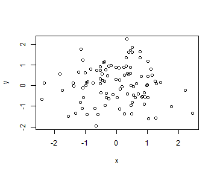
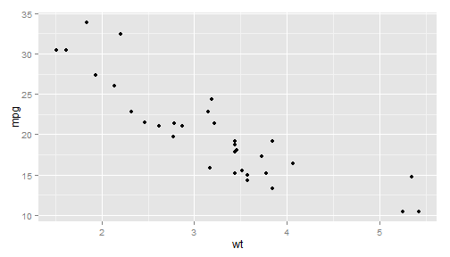

## Shiny Apps!
This shiny app is designed to be an example of interactive code with R.  The page contains 3 tabs, 3 seperate examples
of elegant data analysis possibilites with shiny.  By the way, this presentation is done in SLIDIFY which, it too 
has many elegant features, including the ablility to interact with R and write markdown.

$$\frac{-b \pm \sqrt{b^2 - 4 a c}}{2a}$$

Shiny apps and slidify are the new normal in data presentation
<cite> Me</cite>

2. Use an empty line followed by three dashes to separate slides! 


--- .class #id 


## Interact with R!
1. Code up in R, display code, or not, your choice and display a plot.


```r
y <- rnorm(100); x <- rnorm(100)       
plot(x,y)
```

 

2. When plotting, be aware of the size of the plot.  Adjust size by adding fig.width, and 
fig.height to the r code chunk.


--- .class #id 

## Another example of interaction with R!
1.  Create anothe simple plot!

```r
require(ggplot2)
```

```
## Warning: package 'ggplot2' was built under R version 3.1.2
```

```r
qplot(wt, mpg, data = mtcars)
```



--- .class #id 

## Final Points

1. Slidify makes interactive presenations a breeze.  The shiny app shown 
2. Incorporate R code, and charts and be on your way to a professional presenation that will help you deliver a confident message and a wonderful experience for your audience.

<iframe width="400" height="225" frameborder="0"
  src="http://www.google.com" >
</iframe>

--- 
